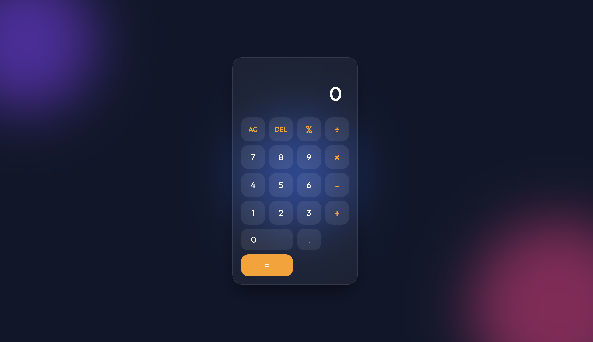

# Modern Glass Calculator

A visually stunning calculator application featuring a modern **Glassmorphism** design aesthetic. This project demonstrates responsive web design, advanced CSS animations, and robust JavaScript logic to create a functional and beautiful user interface.



## 🌟 Features

- **Glassmorphism UI**: Premium frosted-glass effect with dynamic, floating background orbs.
- **Standard Operations**: Support for Addition (+), Subtraction (-), Multiplication (×), Division (÷), and Modulus (%).
- **Interactive Display**:
  - Distinct current and previous operands.
  - Formatted numbers (comma separation) for better readability.
- **Full Keyboard Support**: Type numbers and operators directly from your keyboard.
- **Responsive Design**: Adapts seamlessly to mobile and desktop screens.
- **Animations**: Smooth button hovers and background ambient motion.

## 🛠️ Technologies Used

- **HTML5**: Semantic structure.
- **CSS3**: 
  - CSS Variables for easy theming.
  - Flexbox & Grid layouts.
  - Backdrop-filter for glass effects.
  - Keyframe animations.
- **JavaScript (ES6+)**: 
  - Class-based `Calculator` architecture.
  - Event delegation and DOM manipulation.

## ⌨️ Keyboard Shortcuts

| Key | Action |
| --- | --- |
| `0-9` | Input Numbers |
| `.` | Decimal Point |
| `+`, `-`, `*`, `/` | Operators |
| `Enter` or `=` | Calculate Result |
| `Backspace` | Delete last digit (DEL) |
| `Escape` | All Clear (AC) |

## 📂 Project Structure

```
task2/
├── index.html      # Main HTML structure
├── style.css       # Styling, themes, and animations
├── script.js       # Calculator logic (Class & Events)
└── README.md       # Project documentation
```

## 🎨 Customization

You can easily change the color theme by modifying the CSS variables in the `:root` section of `style.css`:

```css
:root {
    --operator-color: #ff9f0a; /* Change accent color */
    --bg-color: #0f172a;       /* Change background color */
}
```

---
*Created by Atharva Yadav*
---
## 🎥 Website : 
https://atharva-yadav-calculator.netlify.app/
